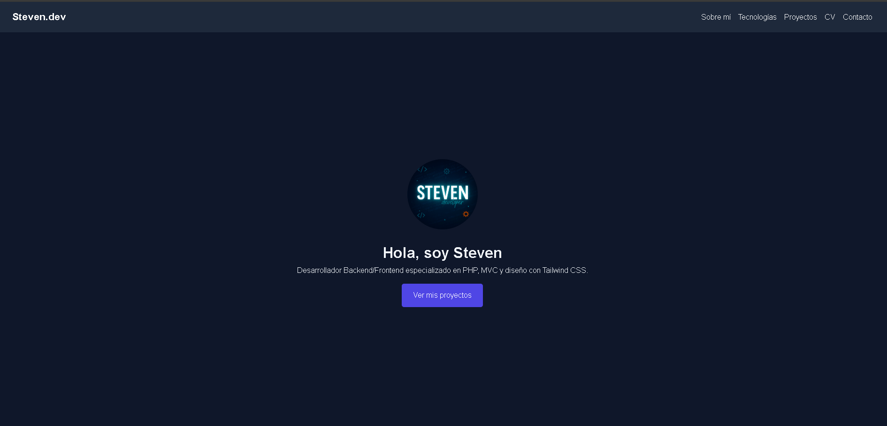
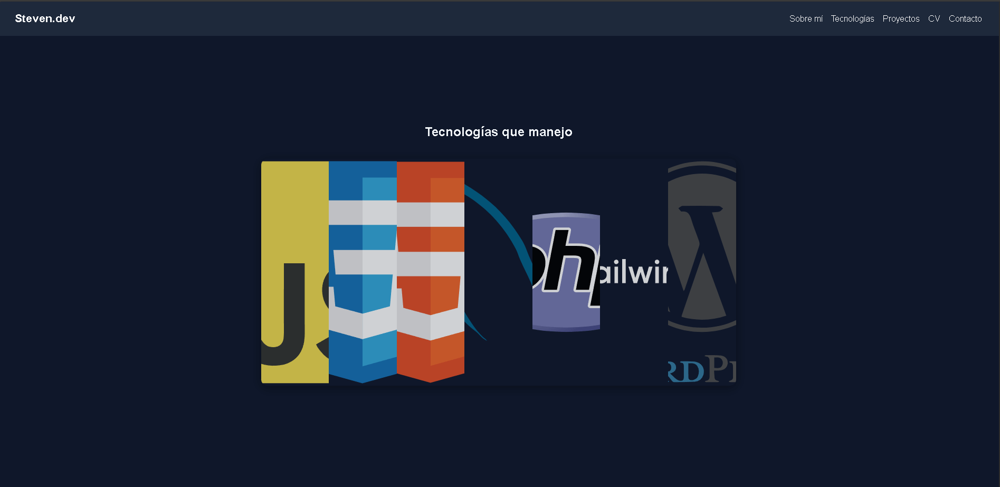
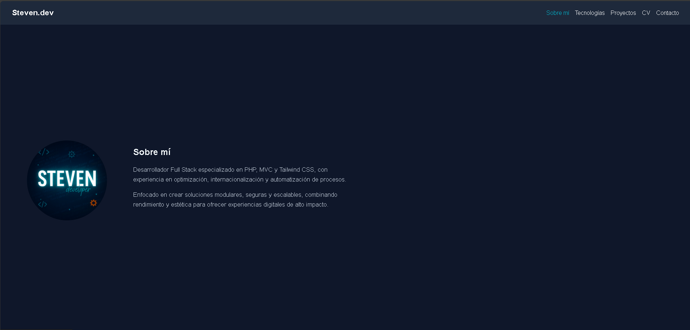
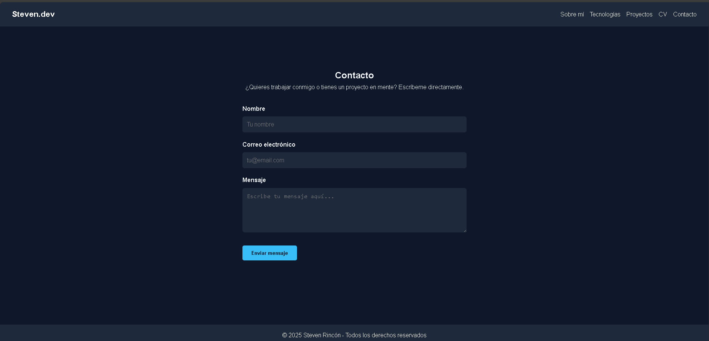

# 🌐 Portafolio Personal – Steven Rincón Medina

**Versión:** 0.1.0  
**Estado:** Activo – Publicado en GitHub Pages  
**Descripción:**  
Landing page profesional con scrollytelling, optimizada para destacar habilidades, tecnologías y proyectos de desarrollo web.  
Diseñada para ser ligera, responsiva y con animaciones fluidas que mejoran la experiencia de usuario.

---

## 🚀 Características principales

- **Diseño de una sola página (Landing Page)** con navegación interna.
- **Scrollytelling bidireccional**: las secciones aparecen con animaciones al entrar y salir de la vista.
- **Galería interactiva de tecnologías** con efecto de expansión al pasar el mouse.
- **Sección "Sobre mí"** en layout de dos columnas (imagen izquierda, texto profesional a la derecha).
- **Formulario de contacto inteligente**:
  - Validación en vivo de campos.
  - Envío directo a Gmail en navegador o cliente de correo predeterminado.
- **Estilo visual coherente** con esquema de colores oscuros y acentos en azul.
- **Optimización de estructura** para carga rápida y mantenimiento sencillo.

---

## 📸 Vista previa

### Hero y navegación


### Galería de tecnologías


### Sección Sobre mí


### Formulario de contacto inteligente


---

## 📂 Estructura del proyecto


PORTFOLIO/
│
├── assets/
│   ├── css/
│   │   └── styles.css
│   ├── js/
│   │   └── main.js
│   ├── img/ 
|   |    └──contacto.png
|   |    └──hero.png
|   |    └──home.png
|   |    └──sobremi.png
|   |    └──tecnologias.png
│   └── docs/
│       └── cv.pdf
├── index.html 
├── .gitattributes 
├── .gitignore 
└── README.md

---

## 🛠️ Tecnologías utilizadas

- **HTML5** – Estructura semántica y accesible.
- **CSS3 / Tailwind CSS (parcial)** – Estilos y animaciones personalizadas.
- **JavaScript (ES6+)** – Lógica de interacción y scrollytelling.
- **Intersection Observer API** – Animaciones al hacer scroll.
- **Git & GitHub Pages** – Control de versiones y despliegue.

---

## 📜 Cambios en la versión 0.1.0

- Eliminación de páginas separadas (`about.html`, `contact.html`) → contenido integrado en `index.html`.
- Limpieza de imágenes no utilizadas → solo se conserva `home.png` y recursos para README.
- Reestructuración de carpetas → `assets/` para CSS, JS e imágenes.
- Implementación de **scrollytelling bidireccional** con efectos variados (`fade-up`, `fade-left`, `fade-right`, `zoom-in`).
- Mejora de la **galería de tecnologías** con efecto de expansión fluido y responsivo.
- Rediseño de la sección **Sobre mí** con layout profesional.
- Integración de **formulario de contacto inteligente**:
  - Validación en vivo.
  - Envío directo a Gmail o cliente de correo.
- Normalización de saltos de línea a **LF** para evitar inconsistencias en Git.

---

## 📦 Instalación y uso local

1. Clonar el repositorio:
   ```bash
   git clone https://github.com/StephenRM-Dr/portfolio.git

📧 Contacto
Si quieres colaborar o tienes alguna propuesta, puedes escribirme a: 
📩 stevenrm09@gmail.com
💼 LinkedIn: www.linkedin.com/in/steven-rincon-medina


📜 Licencia
Este proyecto está bajo la licencia MIT. Puedes usarlo y modificarlo libremente, pero por favor da el crédito correspondiente.